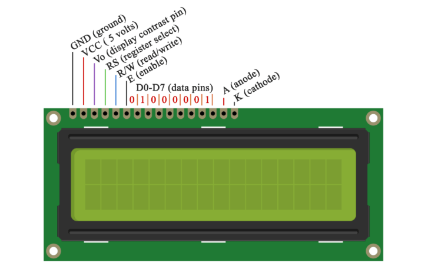

# Current Control
### Description
The goal of this project is to control an electrical current based on the temperature. This is achieved with the following:

A DHT22 temperature sensor is used to measure accurately the temperature in an expected range from -5 to
+15 °C (from 268 to 288 K). An arduino board uses the information from the sensor to control the state of a relay.
Finally, an lcd panel displays the current temperature reading from the sensor as well as the state of the relay in order to 
ensure a smooth and user friendly experience.

### CONNECTING THE LCD

  

  

The LCD’s registers from D4 to D7 will be connected to Arduino’s digital pins from 4 to 7. The Enable pin will be connected to pin number 3 
and the RS pin will be connected to pin number 2. The R/W pin will be connected to Ground and the Vo pin will be connected to the potentiometer 
to adjust the contrast.

### CONNECTING THE DHT22 (TEMPERATURE SENSOR)

  

The DHTxx sensors have four pins, VCC, GND, data pin and a not connected pin which has no usage. A pull-up resistor from 5K to 10K Ohms is required to keep 
the data line high and in order to enable the communication between the sensor and the Arduino Board. There are some versions of these sensors that come with 
a breakout boards with built-in pull-up resistor and they have just 3 pins.

### CONNECTING THE RELAY (THE “FANCY SWITCH”)

  

  

If you use an extension **meant for the EU**, like the one above but it has 3 wires, make sure you use the wires coloured with one colour.
The wire with 2 colours is meant to be used for Ground.

### Dependencies
- [DHTlib from RobTillaart](https://github.com/RobTillaart/Arduino/tree/master/libraries/DHTlib)
